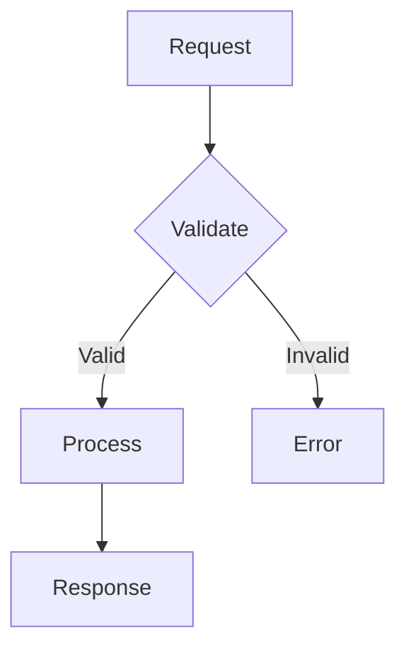
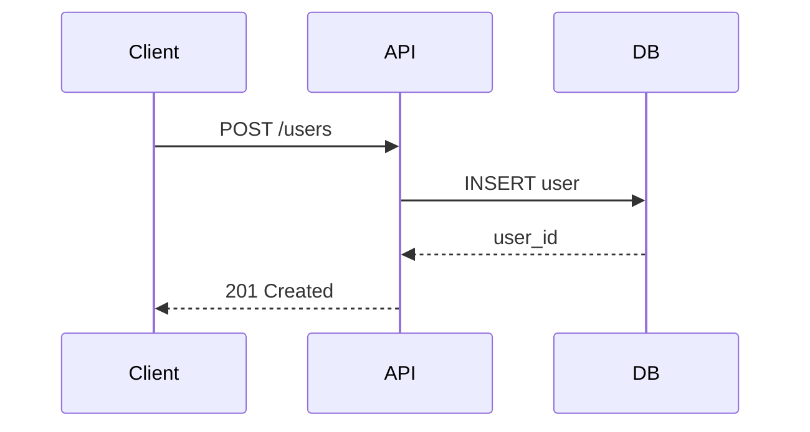
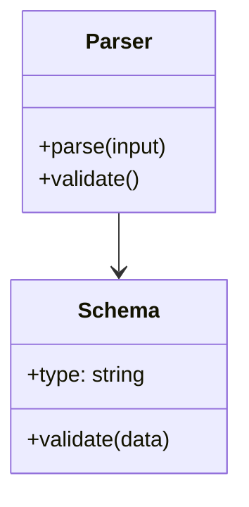
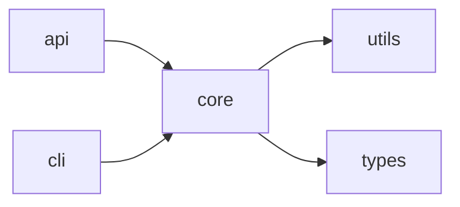
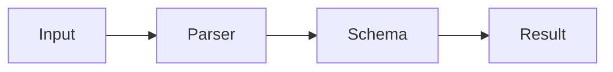

# Creating Diagrams

Use mermaid diagrams to visualize architecture and code flow.

## When to Use Diagrams

- Explaining component relationships
- Showing data flow
- Illustrating architecture
- Mapping dependencies

## Common Diagram Types

### Flowchart (Code Flow)



### Sequence (Interactions)



### Class (Structure)



### Graph (Dependencies)



## Best Practices

1. **Keep it simple** - Focus on key relationships
2. **Label clearly** - Use descriptive node names
3. **Limit nodes** - 5-10 nodes per diagram
4. **Show direction** - Use arrows consistently

## Integration

When explaining code architecture:

1. Explore with opensrc
2. Identify key components
3. Create diagram showing relationships
4. Link to source files

```markdown
The validation flow:



See [parser.ts](https://github.com/...) for implementation.
```
